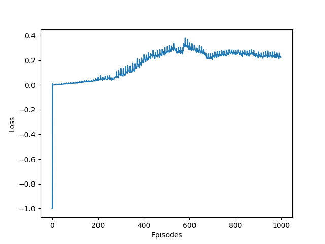
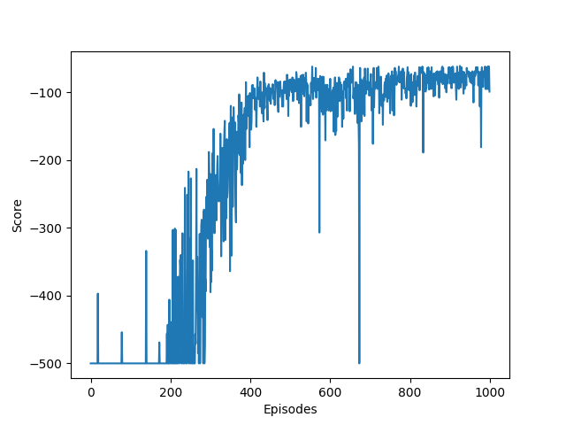
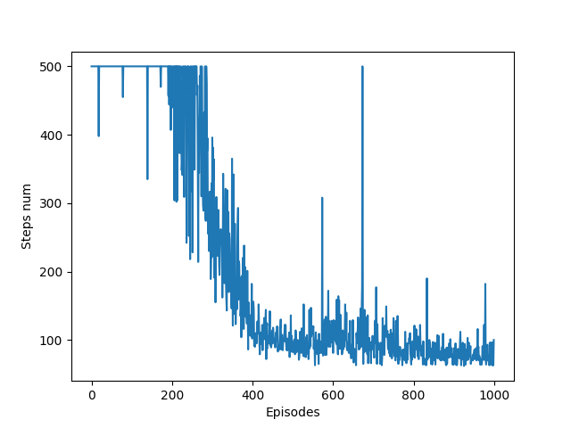

# Acrobot-v1 Deep Q-learning

## Постановка задачі 
  Навчити модель для гри на карті [Acrobot-v1]()
## Розв'язок

  В якості методу використно Deep **Q-learning**.
  
  Для пом'якшення нестабільності навчання використано **Replay Buffers**.
  
## Результати 
  
  
  |:--:|
  | **Loss plot**|
  
  
  |:--:|
  | **Score plot** |
  
  
  |:--:|
  | **Steps number plot** |
  
  За 1000 епізодів навчання середній reward вдалось підвищити з -500 до -74.9 та вирішити поставленю задачу.
  
