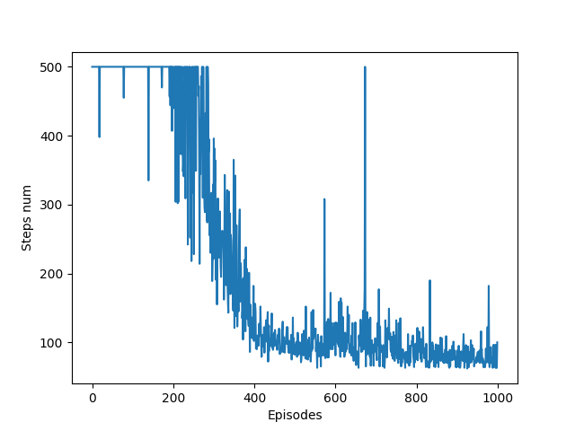

# Acrobot-v1 Deep Q-learning

## Постановка задачі 
  Навчити модель для гри на карті [Acrobot-v1]()
## Розв'язок

  В якості методу використно Deep Q-learning.
  
  Для пом'якшення нестабільності навчання використано **Replay Buffers**.
  
## Результати 
  
  
  |:--:|
  | <b>Loss plot</b>|
  
  
  |:--:|
  | <b>Score plot</b>|
  
  
  |:--:|
  | <b>Steps number plot</b>|
  
  За 1000 епізодів навчання середній reward вдалось підвищити з -500 до -74 та вирішити поставленю задачу.
  
